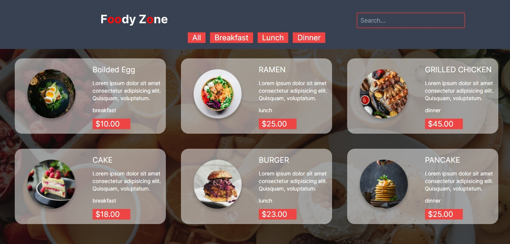

# FoodyZone 🍔🍕

FoodyZone is a user-friendly web application that allows food enthusiasts to explore a diverse range of culinary delights. Built using a powerful combination of React.js, Tailwind CSS, and Node.js, this project offers a seamless and interactive experience for users to discover and enjoy their favorite dishes.

## Features 🌟

-  Responsive Design : FoodyZone boasts a fully responsive layout, ensuring a smooth and enjoyable experience across all devices, from compact smartphones to expansive desktops.

-  Intuitive Search and Filtering : Users can easily search for their desired dishes and further refine their selection by filtering based on meal type (Breakfast, Lunch, Dinner).

-  Visually Appealing Food Cards : The application displays food items in visually striking cards, showcasing the dish's image, name, type, and price.

-  State Management and Data Fetching : FoodyZone seamlessly fetches data from a backend API and manages the application's state, providing a efficient and user-friendly experience.

## Screenshots 📷

Here are some screenshots showcasing the FoodyZone application:

_The responsive header with search and filtering options_

## Technologies Used 🛠️

-  React.js : A JavaScript library for building user interfaces, used as the core framework for FoodyZone.
-  Tailwind CSS : A utility-first CSS framework, providing a highly customizable and responsive styling solution.
-  Node.js : The JavaScript runtime used for the backend API that powers the FoodyZone application.

## Getting Started 🚀

To get started with FoodyZone, follow these steps:

1.  Fork the Repository : Start by forking the FoodyZone repository to your own GitHub account. This will create a copy of the project that you can work on.

2.  Clone the Forked Repository : Clone the forked repository to your local machine using the following command:

    
   git clone https://github.com/your-username/foodyzone.git
    

3.  Install Dependencies : Navigate to the cloned repository and install the necessary dependencies using npm or yarn:

    
   cd foodyzone
   npm install
    

4.  Start the Development Server : Run the following command to start the development server:

    
   npm start
    

   This will start the React development server and launch the FoodyZone application in your default browser.

5.  Explore and Contribute : Now that you have the project running locally, you can explore the codebase, make changes, and contribute to the project. If you have any ideas or find any issues, feel free to create a new issue or submit a pull request.

## Contributing 🤝

If you'd like to contribute to the FoodyZone project, please feel free to submit a pull request or open an issue. Your contributions are greatly appreciated!

Enjoy your culinary adventure with FoodyZone! 🍽️